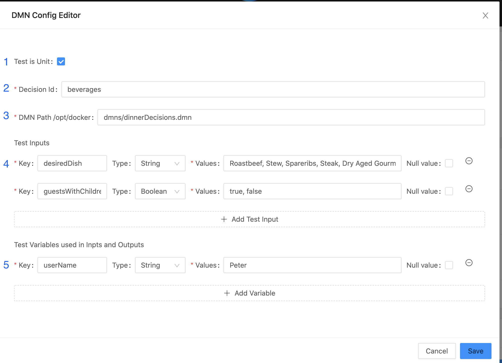

# Camunda DMN Table Tester
A little DMN Table tester with the following Goals:
* As a developer I want to test the DMNs that I get from the Business, even not knowing the concrete rules.
* Business people can create their own tests.
* They can easily adjust the tests to the dynamic nature of DMN Tables.

> This is exactly the kind of tool that as soon as I saw it, I knew it was something I was missing.
>
> I really enjoy being able to help people especially new people with modeling DMN, so I often have people sending me models to validate.
> 
> This tool’s fundamental helpfulness comes first from being able to quickly catch some of the simple common errors, but also in the way it makes it easy for business users to explore the wide variety of possible ways in DMN that decisions can be modeled. This was in fact the original goal of DMN and this is a strong step towards narrowing the Business IT Gap for the standard.
>  
> **Niall Deehan** Developer Relations Camunda

## Usage
I wrote two blog article that explains how you can use it:

* [Testing (Camunda)-DMN Tables automatically](https://pme123.medium.com/testing-camunda-dmn-tables-automatically-713497ab57e6)

* [Use the DMN Tester for Continuous Integration CI](https://pme123.medium.com/testing-camunda-dmn-tables-automatically-part-2-d3931ed38f51)

And there is a Recording from Camunda Community Summit:
* [Testing DMN Tables Automatically](https://page.camunda.com/ccs-mengelt-testing-dmn-tables-automatically) 

## Test Configuration

**1 Test Mode**
  
  You can configure a DMN Table Test as:

  - a Unit test (the inputs are not created from evaluating the depending decisions - you define them directly)
  - with all its dependent Inputs (decisions like DMN Tables or Literal Expressions).

**2 Decision Id**

  The id of your table - be aware this is not the name
  - you only find it in the 'Edit DRD' Panel with the DMN Table Object selected.

**3 Path of the DMN**
  
  This path depends on your Docker Image (check _runDmnTester.sh_).
  
  Example: `-v $(pwd)/dmns:/opt/docker/dmns \` 
  - This assumes your DMNs are in a folder _dmns_.
  - So your Path would be `dmns/MyDmn.dmn`.

**4 Test Inputs**

  Add the following for each Input:
  - Key: This is what you need in your input expressions.
  - Type: The Type specified.
  - Values: A comma separated list of all possible inputs.
  - Null Value: If it is possible that the input may be _null_ (not required), check this box.

**5 Test Variables** 

  You can define Variables you use in your Rules. Usually one value is enough.

## Technologies
This projects builds on cool Open Source Projects. So my thanks go to:

### Shared
* [Autowire](https://github.com/lihaoyi/autowire):
  > Autowire is a pair of macros that allows you to perform type-safe, reflection-free RPC between Scala systems.
* [BooPickle](https://boopickle.suzaku.io):
  > BooPickle is the fastest and most size efficient serialization (aka pickling) library that works on both Scala and Scala.js.

### Client
* [Slinky](https://slinky.dev)
  > Write React apps in Scala just like you would in ES6
* [Scalably Typed](https://scalablytyped.org)
  > The Javascript ecosystem for Scala.js!
  I used the facades for Ant Design
* [Ant Design](https://ant.design)
  >A design system for enterprise-level products. Create an efficient and enjoyable work experience.

### Server
* [Scala DMN](https://github.com/camunda/dmn-scala)
  > An engine to execute decisions according to the DMN 1.1 specification.
* [http4s](https://http4s.org)
  > Typeful, functional, streaming HTTP for Scala.
* [ZIO Config](https://zio.github.io/zio-config/)
  > A functional, composable ZIO interface to configuration
* [ZIO](https://zio.dev)
  > Type-safe, composable asynchronous and concurrent programming for Scala

### Start Script
* [Ammonite](https://ammonite.io/#Ammonite)
  > Ammonite lets you use the Scala language for scripting purposes: in the REPL, as scripts, as a library to use in existing projects, or as a standalone systems shell.
## Development
### Server
`sbt server/run`

This starts the Web Server on **Port 8883**.

>This copies the client assets to the classpath of the server.
> So make sure you run `npm run build` before.
>
> Or use the client as described in the next chapter.

### Client
`npm run dev`

This will watch all your changes in the client and automatically refresh your Browser Session.
This uses [Vite](https://vitejs.dev/guide/).

Open in the Browser **http://localhost:5173**.

## Releasing
Just run `amm ./publish-release.sc VERSION`.

Due to problems with the `"org.xerial.sbt" % "sbt-sonatype"` Plugin you have to release manually:
- https://s01.oss.sonatype.org/#stagingRepositories
  - login
  - check Staging Repository
  - hit _close_ Button
  - hit _release_ Button
    
> if you do not see any of the buttons or repository hit the _refresh_ Button.

### Local publish
Just run `amm ./publish-release.sc VERSION-SNAPSHOT`.

For now as soon as you publish a SNAPSHOT - it is always published locally.

### Docker
There are 2 Docker Images:

1. The DMN Tester App:

   `sbt server/docker:publishLocal` creates a Docker Image - see also next chapter.

2. The Unit Test Creator:
   See its [README.md](docker/README.md)
   
## Try it out
There are Docker Images you can use with an example in the `demo` directory.

`cd demo`

See the according [README](demo/README.md)
