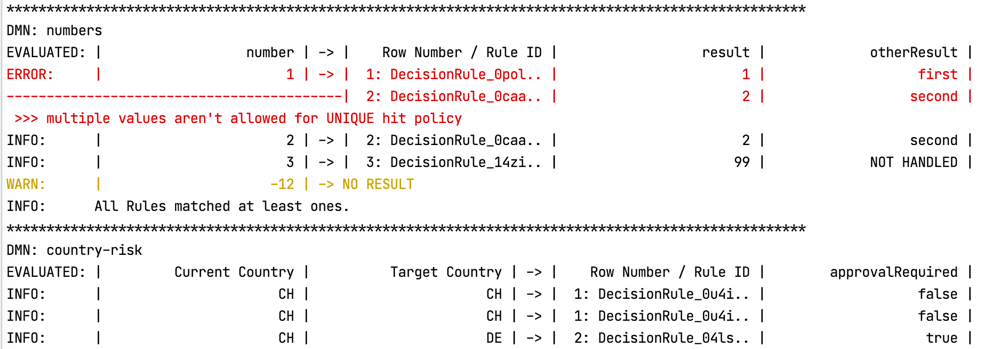

# Camunda DMN Table Tester
> As a developer I want to test the DMNs that I get from the Business, even not knowing the concrete rules.

The goal of this project is to support that as good as possible.

For this it uses [**Scala DMN**](https://github.com/camunda/dmn-scala).

This is work in progress, so the features it provides so far:
* Define your test in simple Config Files (HOCON).
* Provide a Script that runs all the Tests (Ammonite).
* Display the result in the console:
  
  * All matched Rules for its inputs.
  * A Warning if no Rule matched.
  * An Error if there is one.
  * An Error if a Rule could not be parsed.
 
## Usage
> At the moment I am waiting for this [Pull Request](https://github.com/camunda/dmn-scala/pull/16)
> to release the first version.
See [dmnTester/README](dmnTester/README.md)
